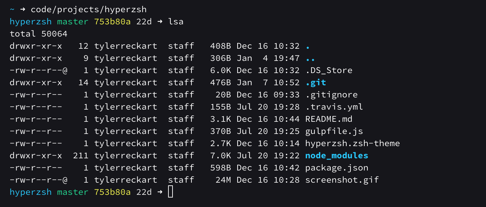

#### H Y P E R Z S H  


Hyperzsh is a [z shell](http://www.zsh.org/) theme designed to complement a git-focused workflow. It gives you a comprehensive overview of the branch you're working on and the status of your repository throughout the development process without cluttering your terminal.  

It currently shows (in order of the prompt):  
- Current working directory
- Git branch
- [Current SHA](#current_sha) (optional)
- Exit code of last command
- Time since last commit
- Git status
- Background Jobs

## Installation  
### For [antigen](https://github.com/zsh-users/antigen) users
1. Add `antigen bundle tylerreckart/hyperzsh` to your `.zshrc`. Antigen will clone and load the hyperzsh repository automaticall the next time you start a zsh session.  

### For [oh-my-zsh](http://ohmyz.sh) users  
If you're using oh-my-zsh, follow these steps to install hyperzsh:  
1. `mkdir $ZSH_CUSTOM/themes` _You can skip this command if the directory exists already_
2. `wget -O $ZSH_CUSTOM/themes/hyperzsh.zsh-theme https://raw.githubusercontent.com/tylerreckart/hyperzsh/master/hyperzsh.zsh-theme`  
3. `vim ~/.zshrc`  
4. Set `ZSH_THEME="current_theme"` to `ZSH_THEME="hyperzsh"`  

### For [Zgen](https://github.com/tarjoilija/zgen) users
1. Add `zgen load tylerreckart/hyperzsh` to your `.zshrc` with your other `zgen load` statements.  
`zgen save` and zgen will automaticall handle cloning the repository for you.  

## Options  
Hyperzsh is highly configurable. It was build to seamlessly integrate git into my workflow, but my choices may not work for you. Everything from the icons to colors are customizable to whatever you want. Itching to slap some emoji in there? Go for it!

### Show current SHA <a name="current_sha"></a>   

If you'd like to view your branch's current SHA, there's already support baked into the theme. All you have to do is edit `hyperzsh.zsh-theme` and un-comment the Prompt with SHA and ensure that the default prompt gets commented out or removed.

```zsh
# The prompt
# PROMPT='$(_user_host)$(_python_venv)%{$fg[cyan]%}%c $(git_prompt_info)%{$reset_color%}$(git_prompt_short_sha)%{$fg[magenta]%}$(_git_time_since_commit)$(git_prompt_status)${_return_status}➜ '

# Prompt with SHA
PROMPT='$(_user_host)$(_python_venv)%{$fg[cyan]%}%c $(git_prompt_info)%{$reset_color%}$(git_prompt_short_sha)%{$fg[magenta]%}$(_git_time_since_commit)$(git_prompt_status)${_return_status}➜ '
```

#### Example  

 

### Status Indicators  
| Variable | Indicator | Meaning |
|----------|-----------|---------|
| `ZSH_THEME_GIT_PROMPT_UNTRACKED` | ◒ | Untracked files |
| `ZSH_THEME_GIT_PROMPT_ADDED` | ✓ | Files added to git |
| `ZSH_THEME_GIT_PROMPT_MODIFIED` | △ | Modified files |
| `ZSH_THEME_GIT_PROMPT_DELETED` | ✖ | Deleted files |
| `ZSH_THEME_GIT_PROMPT_RENAMED` | ➜ | Renamed files |
| `ZSH_THEME_GIT_PROMPT_UNMERGED` | § | Unmerged files |
| `ZSH_THEME_GIT_PROMPT_AHEAD` | ▲ | Repo ahead of current branch |
| `ZSH_THEME_GIT_PROMPT_DIRTY` | ✗ | Dirty repository |

### Right hand prompt  
The right hand prompt displays the current branch, time since last commit, as well as commit status of the repository  

| Variable | Branch Color |
|----------|--------------|
| `ZSH_THEME_GIT_TIME_SINCE_COMMIT_SHORT` | Green |
| `ZSH_THEME_GIT_TIME_SINCE_COMMIT_MEDIUM` | Yellow |
| `ZSH_THEME_GIT_TIME_SINCE_COMMIT_LONG`  | Red |
| `ZSH_THEME_GIT_TIME_SINCE_COMMIT_NEUTRAL` | White |

## License
MIT [Tyler Reckart](https://github.com/tylerreckart)
